This tutorial introduces the fundamentals of the **GEM Editor**. It will cover the basic layout of the editor and
provide an overview of the most important menus and features.

Be sure to check out the [Keybindings Tutorial](https://gem-tools.vercel.app/tutorials/keybindings) for a complete list
of all keybindings.

## Map Menu

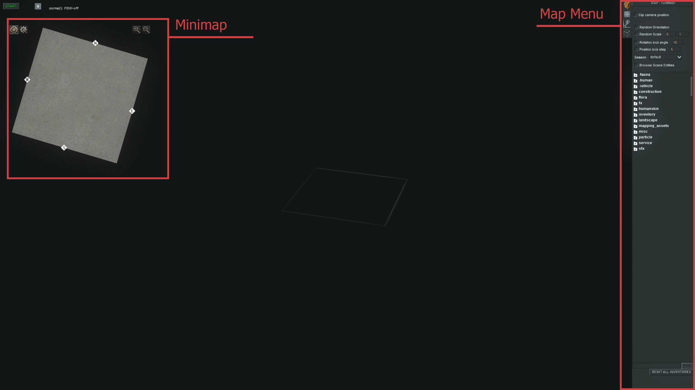

This is the first screen you see when launching the editor. On the left side, you will find the minimap.  
On the right side you will see the **Map Menu**,
which contains four tabs:

- **Entity**
- **Land**
- **Clip**
- **Edifice**

While the **Map Menu** is active, you can use the **1–4** number keys to switch between the tabs.

### Entity

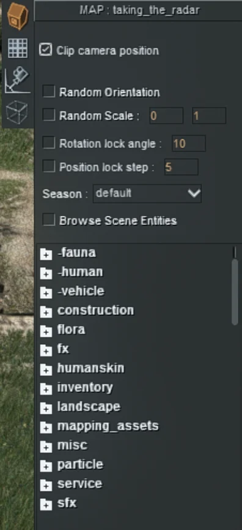

The **Entity** tab allows you to place any object, vehicle, human, etc. that is available in the editor. Which entities
you can place
depends on the expansions you have purchased for *Gates of Hell – Ostfront*. Although the entities are still displayed
in the drawer,
they are greyed out and cannot be selected.

At the top, you have multiple options to configure entity placement as well as scene-related options.

| Option                | Description                                                      | Note        |
|-----------------------|------------------------------------------------------------------|-------------|
| Clip Camera Position  | If checked, the camera will not clip through objects/ground/etc. | -           |
| Random Orientation    | Randomizes the orientation of the entity when placed.            | 0 ≤ x ≤ 360 |
| Random Scale          | Randomizes the scale of the entity when placed.                  | 0 ≤ x ≤ 1   |
| Rotation lock angle   | Locks the rotation of the entity to a specific angle.            | 0 ≤ x ≤ 360 |
| Position lock step    | Locks the position of the entity to a specific step.             | -           |
| Season                | Selects the default season texmod for an entity when placed.     | -           |
| Browse Scene Entities | Restricts entity placement to entities in the current scene.     | -           |

**Note:** The search functionality in the GEM Editor is not perfect. It does not support full-text search or partial
keyword
matching (e.g., searching for "**_industry**" will not return "**euro_industry_stairs_high_x**").

For that, I recommend using the [Editor Objects Search](https://gem-tools.vercel.app/resources) instead.

### Land


In this tutorial, I will only cover the basics of the **Land** tab. If you want a deep dive into the land editing
features,
I recommend checking out the **Land Editor Tutorial (coming soon)**.

At the top, you have seven different land editing options:

- **Heights**: Adjust the height of the map.
- **Colors**: Paint the map in any color.
- **Polygons**: Select the different polygon sizes you want. There are six different levels to choose from (**0 = least
  detail, 5 = most detail**).
- **Textures**: Select the different textures for your map.
- **Grass**: Select the different types of grass you want to place on your map.
- **Ocean**: Select whether the ocean should be enabled or not.

Although the following options are tied to **Heights**, I will still cover them briefly since I think they are quite
important.

There are two different sliders: the first controls the softness/sharpness of the brush, and the second controls
the brush speed.

Below the sliders are the heightmap-related options. In this tutorial, I will not cover them in detail, although
**Fixed height** and **Water altitude** are important:

- **Fixed height**: If checked, the brush will set the height of the terrain to the value you set in the input.
- **Water altitude**: Sets the altitude of the water level.
    - **Example**: If you set this to **100** (and set **Fixed height** below that), all terrain you modify with the
      brush will be **below** the water line.

If you want to learn more about the heightmap options, check out the **Land Editor Tutorial (coming soon)**.

### Clip

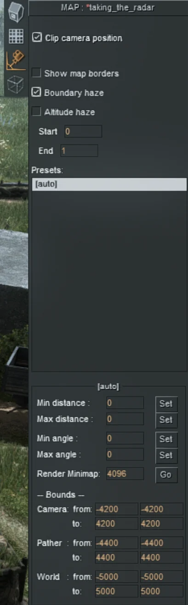

The **Clip** tab allows you to set the following options:

- **Show map borders**: If checked, it will show the different borders of the map, each with a different color.
- **Boundary haze**: If checked, the map will have a haze effect around the edges.
- **Altitude haze**: If checked and based on **Start** and **End**, the map will have a haze effect around this altitude
  range.

Below that, you have the **Presets** section. Here you can define different clip presets, or adjust the auto-generated
ones. This works best
with **Show map borders** enabled.

| Border Color | Description                                                                                                                                                                                                                                                    |
|--------------|----------------------------------------------------------------------------------------------------------------------------------------------------------------------------------------------------------------------------------------------------------------|
| Yellow/Green | Connected with each other; **Yellow** represents the limit of unit movement. Units can't enter the area behind the yellow line. **Green** should remain on the map and as close as possible to the **Purple** line to keep as much playable space as possible. |
| Purple       | Marks the map's outermost border.                                                                                                                                                                                                                              |
| Blue         | Represents the limit of the camera center. You can't scroll out of the map further than the point where your camera center reaches this line.                                                                                                                  |

The option **Render Minimap** will render a top-down view of the map at the resolution entered in the input (in this
example **4096**). The preview will be placed
in the root folder of your saved map. For example:

```
Call to Arms - Gates of Hell\resource\map\test-map\minimap.png
```

If you want to learn more about the Map Borders, check out the [Map Borders Tutorial](/tutorials/map-borders).

### Edifice

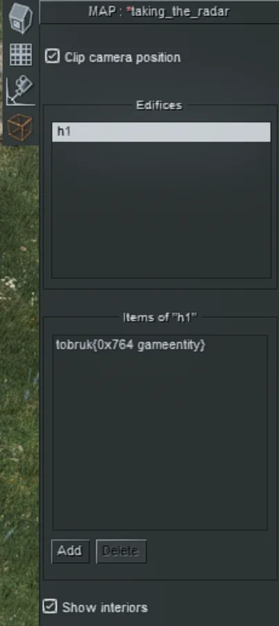

The **Edifice** panel is used to manage how buildings behave during gameplay. It primarily controls building grouping
and building-related behavior,
such as roof/interior visibility.

The building list in the edifice panel (for example **H1**, **H2**, etc.) represents **building groups**.

- Each entry corresponds to a logical building unit.
- A group defines how the editor treats one or more building objects as a single structure.
- Groups can affect shared building behavior, such as roof visibility.

The option **Show Interiors** toggles roof visibility globally, allowing you to hide or show the roofs of buildings
while editing.

## Mission Menu

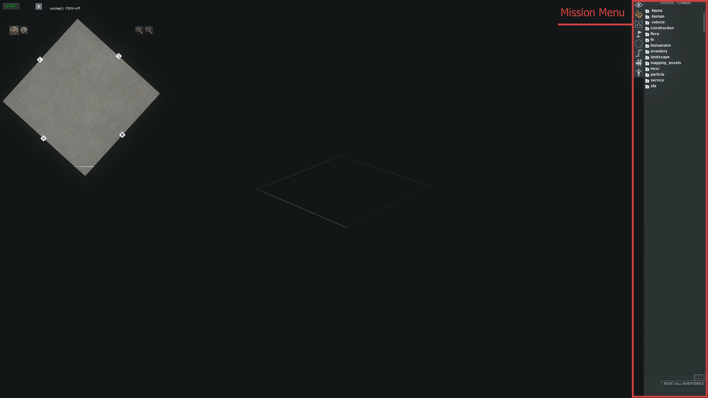

You can access the **Mission Menu** by pressing **F3**. It contains all the settings for the current mission.
There you can find eight tabs:

- **View**
- **Entity**
- **Squad**
- **Waypoint**
- **Zone**
- **Trigger**
- **Camera**
- **Cover**

While the **Mission Menu** is active, you can use the **1–8** number keys to switch between these tabs.

### View

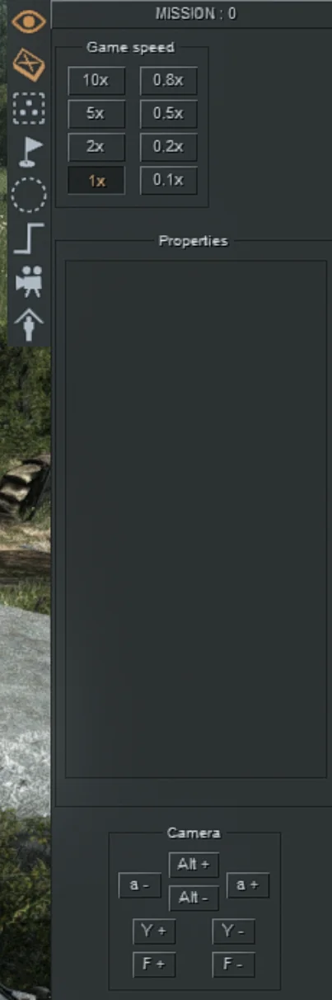

The **View** tab lets you set the game speed and manually adjust the camera position.

### Entity

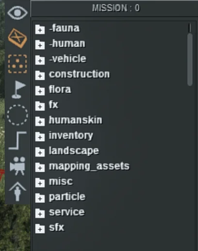

You might have noticed that the **Entity** tab is also present in the **Mission Menu**. While the Entity tab in the Map
Menu
also allows you to place entities, this tab is more focused on placing units and vehicles.

As with the Entity tab, I recommend checking out the [Editor Objects Search](https://gem-tools.vercel.app/resources) for
a better search experience.

### Squads

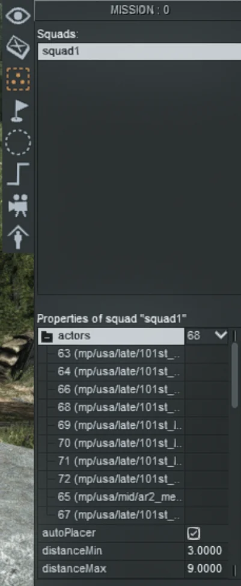

The **Squad** tab allows you to create and manage squads for your mission. You can create new squads and assign units to
them. At the top, you can see the list of all squads in the mission.
When a squad is selected, you can see the properties of the selected squad, including:

- **actors**: The current actors assigned to the squad
- **autoPlacer**: TBE
- **distanceMin**: TBE
- **distanceMax**: TBE
- **radius**: TBE
- **commanderAhead**: TBE

### Waypoints

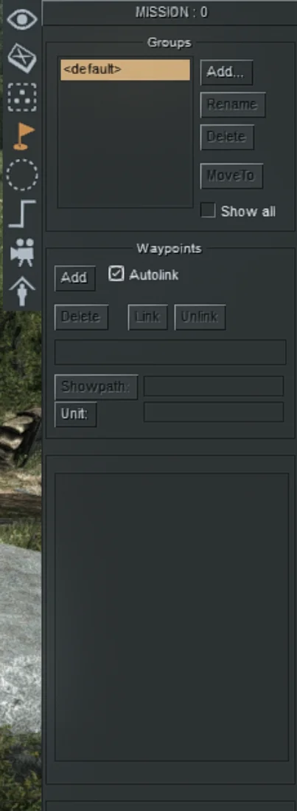

The **Waypoints** tab allows you to create and manage waypoints. You can create waypoint groups and assign multiple
waypoints to them. When creating a group, you can click **Add**.
This will attach a pin icon to your cursor, which you can place anywhere on the map.

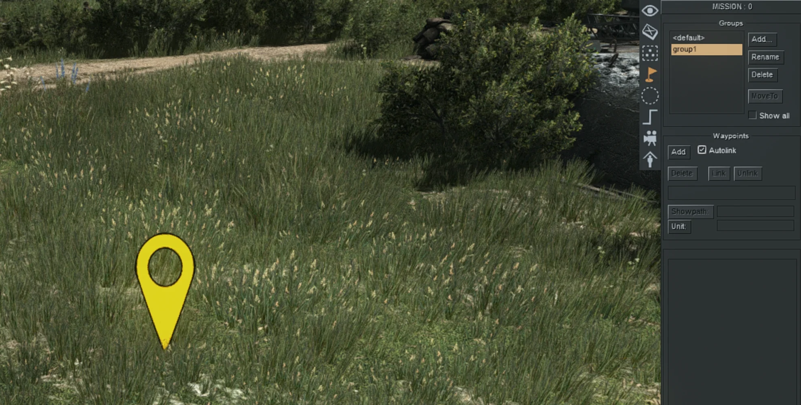

After placing the pin, you can select it. You can see the properties of the waypoint in the bottom right corner. There
are multiple options for the waypoint:

- **position**: The position of the waypoint in the world
- **uid**: The unique identifier of the waypoint
- **radius**: The radius of the waypoint
- **offset**: The height offset (helps with spawning FX at the waypoint)
- **random_position**: TBE

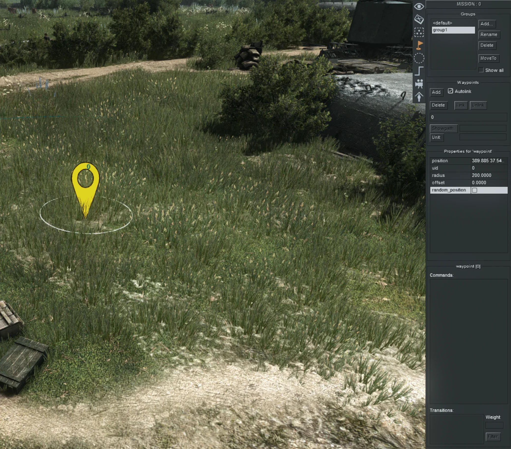

### Zone

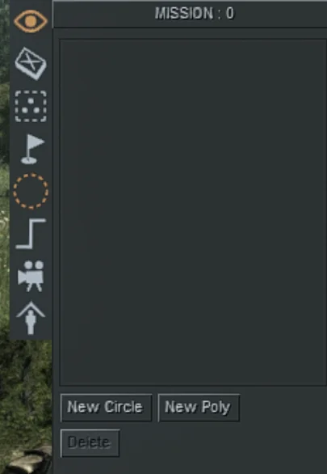

The **Zone** tab allows you to create and manage zones that are used for more complex scenarios, which are not covered
in this tutorial. You can create either a circle or a poly (rectangular) zone.

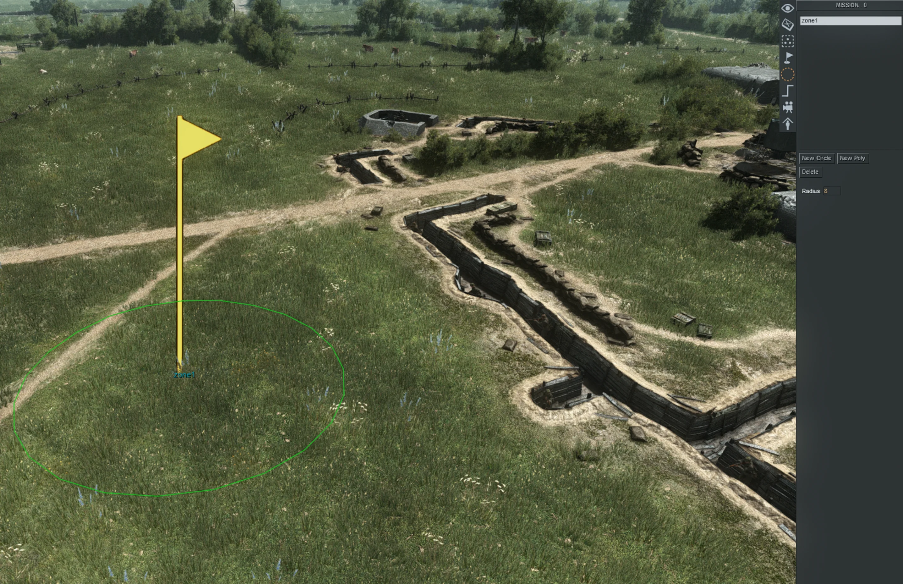

### Trigger

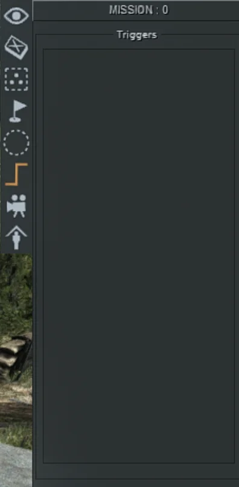

The **Trigger** tab consists of two sections: **Condition** and **Commands**. The Condition section defines **when** a
trigger is activated. The Commands section defines **what** happens when the trigger is activated.

There are multiple options to choose from, but they will not be covered in detail in this tutorial.

If you want to learn more about triggers, be sure to check out the **Trigger Editor Tutorial (coming soon)**.

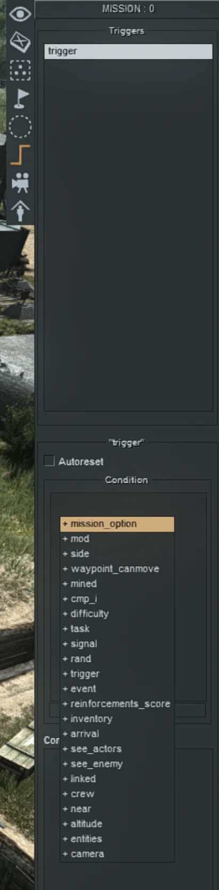

### Camera

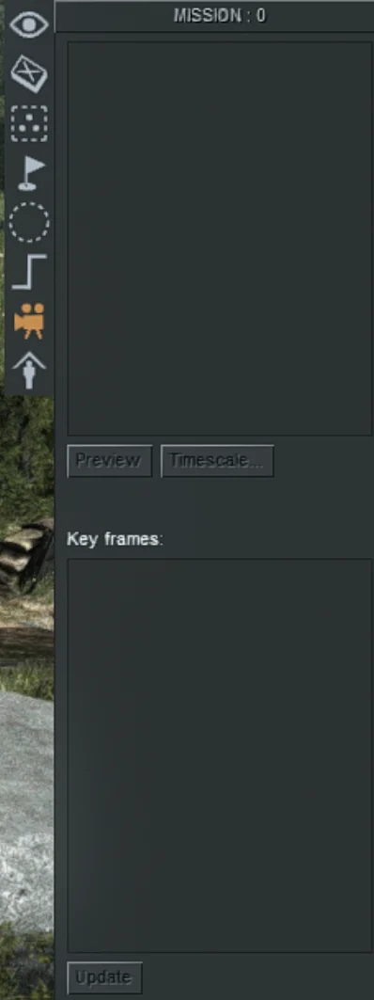

The **Camera** tab allows you to set up cinematic cameras for your mission. You can create multiple cameras and assign
multiple keyframes to them. The keyframes depict the
position and orientation of the camera at a specific time.

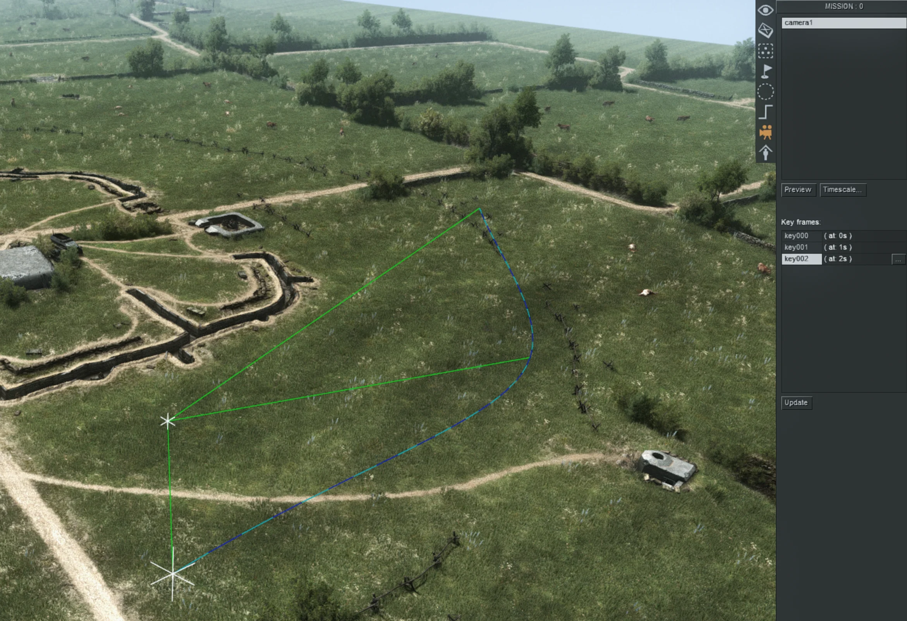

You can see three green lines and one cyan-blue line connecting them in the image above. The green lines represent the
keyframes, and the cyan-blue line represents the path the camera will take.
To preview the cinematic camera, press **Preview**.

### Cover

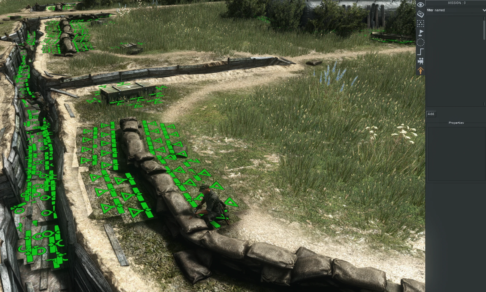

If you are familiar with *Gates of Hell – Ostfront* or *Men of War*, you know how the cover system works. The **Cover**
tab shows you all cover points the units can use during gameplay.

If you select a cover spot, you can see different options:

- **type**: The type of the cover spot (whether a unit can lie down, crouch, stand, etc.)
- **name**: A custom name for that specific spot (useful if you want to tie it to a trigger)
- **off**: Disables the cover spot, so units can't use it
- **priority**: Units will use the cover spot with the highest priority first

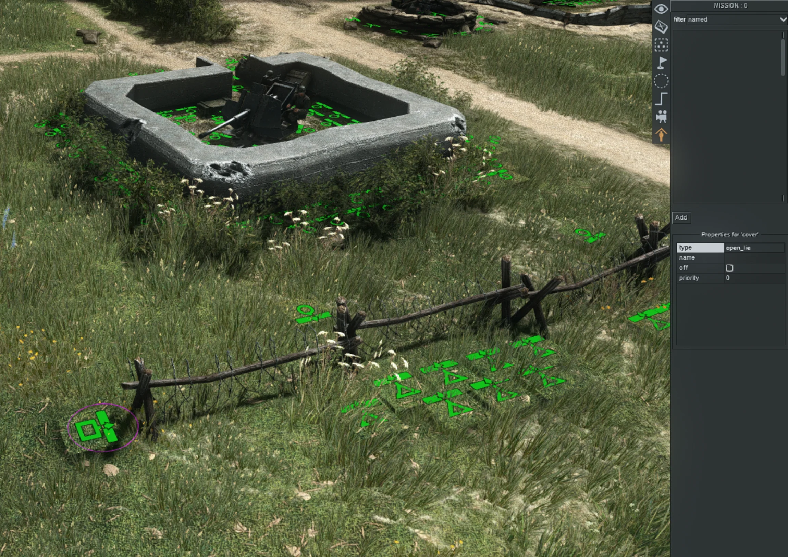

## FX Editor

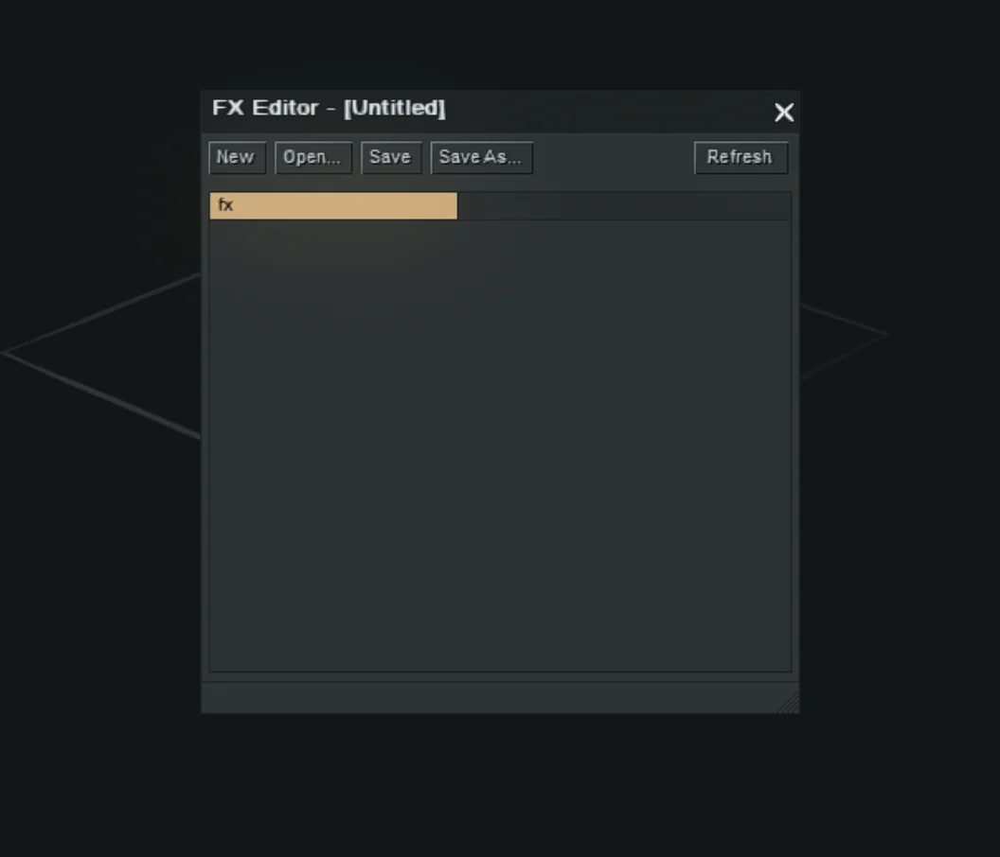

You can access the **FX Editor** by pressing **F4**. Here you can edit, create, and open all FX for the current mission.

## Environment

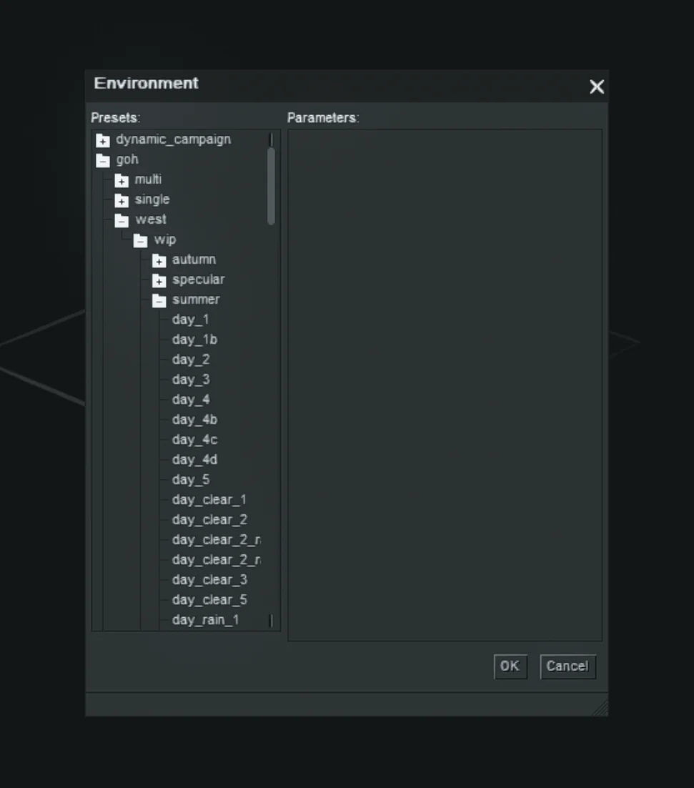

You can access the Environment Editor by pressing **F6**. Here you can set various environmental parameters for the
current mission.
You can find the following parameters:

- **Light**
- **Wind**
- **Haze**
- **Sky**
- **Weather**
- **Ocean Wave Works**
- **Thunder**
- **Video Overlay**
- **DOF (Depth of Field)**
- **Glow**
- **Render Tweaks**

## Editor Globals

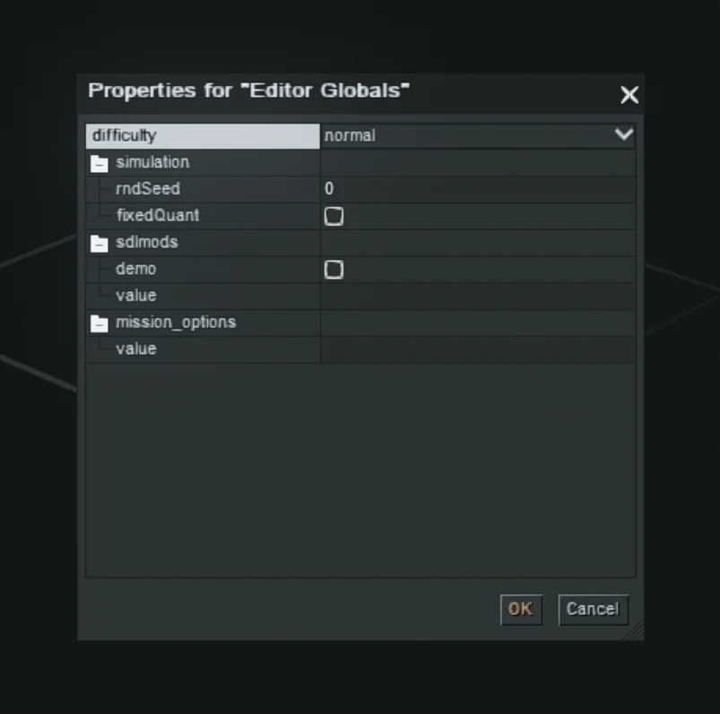

You can access the Editor Globals by pressing **F7**. Here you can set various global parameters for the editor, such as
the current difficulty.

---

There are a lot more things to cover. Be sure to check out the other tutorials on the website for more information.
Thank you for reading!
