This tutorial explains the commands found in **actor**.

To see the glossary, check it out here: [Editor Commands Glossary](/tutorials/editor-commands)

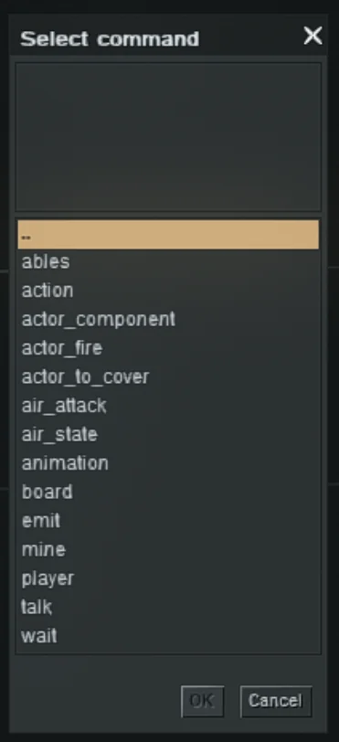

## ables

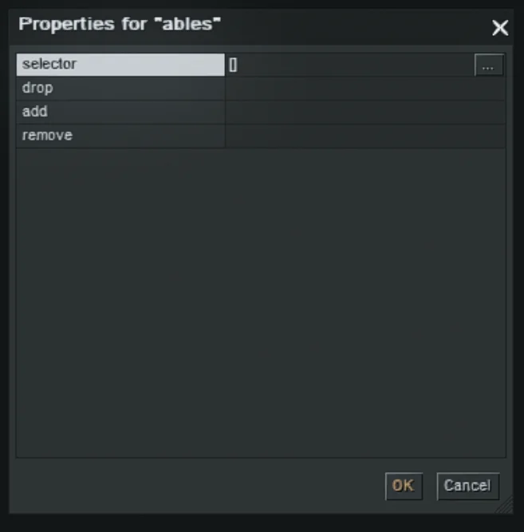

Adds or removes abilities (properties) from selected entities.

**Parameters:**

- **selector**: targeted entity/actor(s) (see *Selector*)
- **drop**:
    - *orders*: TBE
    - *sensor*: TBE
    - *senseless*: TBE
- **add**: ability to add (chosen from the dropdown list)
- **remove**: ability to remove (chosen from the dropdown list)

## actor_fire

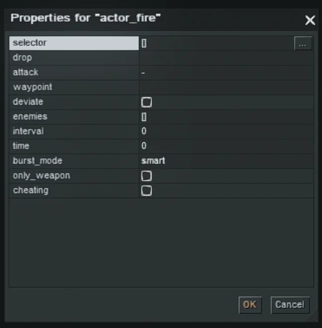

Makes selected actors fire at a target waypoint.

**Parameters:**

- **selector**: actor(s) that start firing (see *Selector*)
- **drop**:
    - *orders*: TBE
    - *sensor*: TBE
    - *senseless*: TBE
- attack
    - *position*: actor(s) fire on a specified waypoint
        - When **attack → position** selected:
            - **waypoint (.uid / .name)**: target waypoint (by ID or name)
    - *enemies*: actor(s) fire on specified enemies
        - When **attack → enemies** selected:
            - **enemies**: actor(s) to fire upon
            - **interval**: TBE
            - **time**: TBE
- **deviate**:
    - `–` exact fire
    - `✓` fire with deviation (inaccurate)
- **burst_mode**: duration between shots
- **only_weapon**: TBE
- **cheating**: TBE

## actor_to_cover

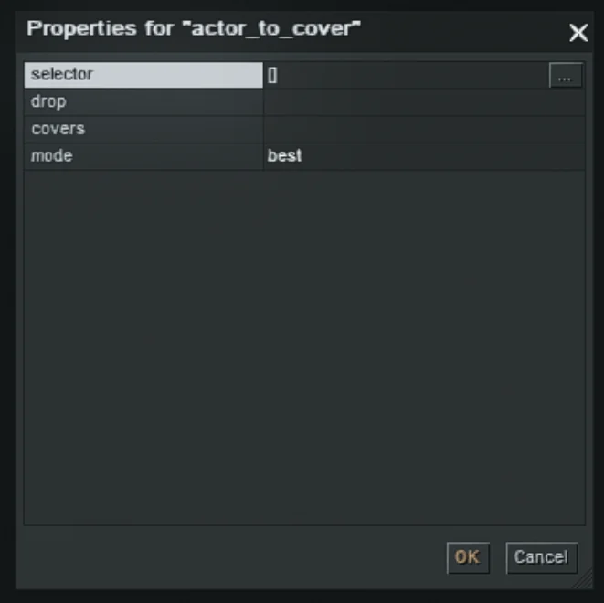

Directs actors into cover.

**Parameters:**

- **selector**: actors to send to cover (see *Selector*)
- **drop**:
    - *orders*: TBE
    - *sensor*: TBE
    - *senseless*: TBE
- **covers**: one or more cover names (optional). If not specified, actors move to the nearest available cover.
- **mode**:
    - *best*: TBE
    - *random*: TBE
    - *density*: TBE

## air_state

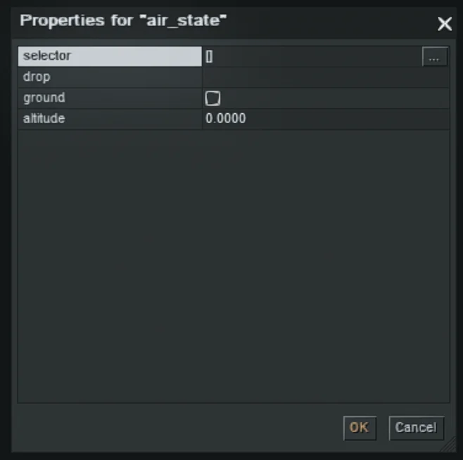

Controls aircraft movement.

**Parameters:**

- **selector**: aircraft (see *Selector*)
- **ground**:
    - `–` normal flight at the assigned altitude
    - `✓` aircraft moves on the ground (altitude becomes irrelevant)
- **altitude**: flight altitude in meters

## animation

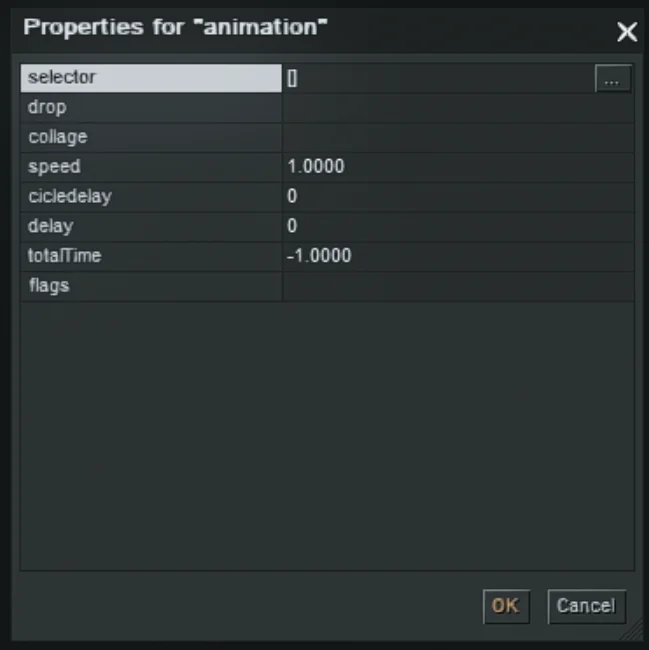

Plays one or more animations on the selected actor.

You can find the complete list of animations here: [Animations list](/animations)

**Parameters:**

- **selector**: actor that plays the animation (see *Selector*)
- **collage**: list of animations to play
- **speed**: animation playback speed
- **cicledelay**: delay between animations
- **delay**: delay after all animations finish
- **totalTime**: total time of the animation sequence
- **flags**: whether animations loop and/or are chosen randomly

## board

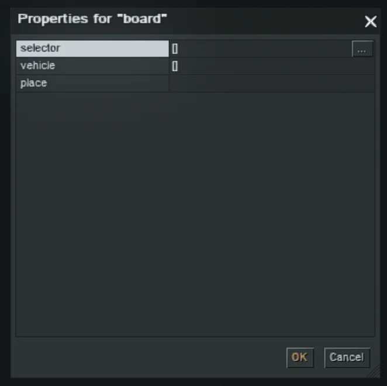

Orders actors to board a vehicle or cannon. (Used at a waypoint.)

**Parameters:**

- **selector**: actor(s) which should board a vehicle
- **vehicle**: which vehicle actor(s) should board
- **place**: seat/role to take (optional):
  `gunner`, `driver`, `commander`, `charger`
  If omitted, seat order is determined by default.

## emit

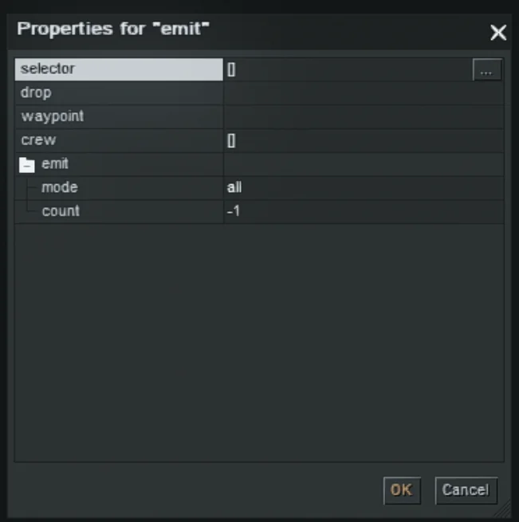

Sets actors down (disembark) at a waypoint.

**Parameters:**

- **selector**: determines where actors get off from (see *Selector*)
- **drop**:
    - *orders*: TBE
    - *sensor*: TBE
    - *senseless*: TBE
- **waypoint (.uid / .name)**: waypoint to disembark at
- **crew**: actor(s) which should get off
- **emit .mode**: who gets off: `all`, `passengers`, `crew`
- **emit .count**: number of actors to detruck
  If set to `–1`, then all get off (respecting `emit .mode`)

## player

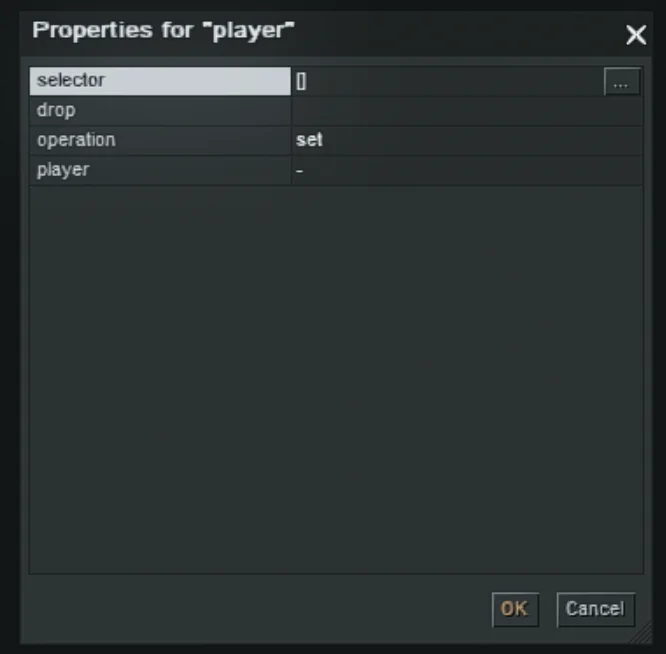

Changes which player/side an actor belongs to.

**Parameters:**

- **selector**: actors whose ownership changes (see *Selector*)
- **drop**:
    - *orders*: TBE
    - *sensor*: TBE
    - *senseless*: TBE
- **operation**:
    - *set*: TBE
    - *mask_set*: TBE
- **player**: the new player the actors will belong to

Common use cases: prisoners, defection, interrogation scenarios.

## talk

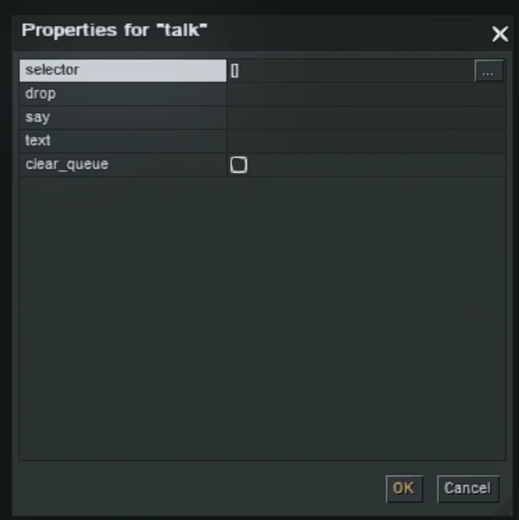

Makes an actor speak a phrase or phrase group (displayed above the actor).

**Parameters:**

- **selector**: the speaker (see *Selector*)
- **drop**:
    - *orders*: TBE
    - *sensor*: TBE
    - *senseless*: TBE
- **say**: phrase name (from `say.set`). Multiple variants can exist; one is chosen randomly at runtime.
- **text**: text which should be said
- **clear_queue**: TBE

## wait

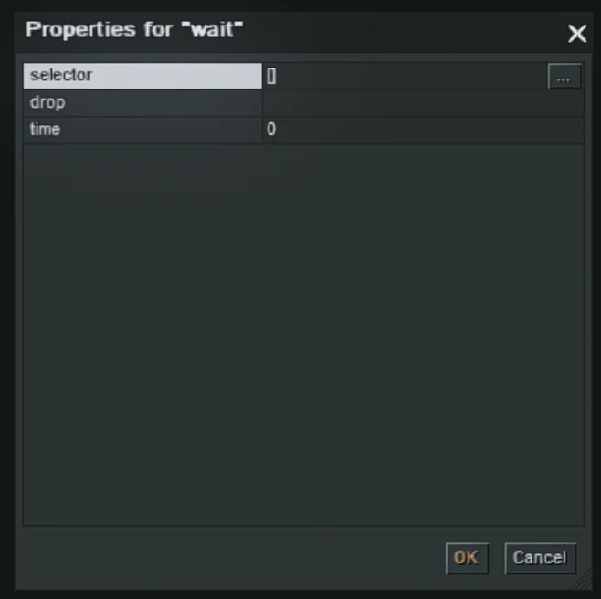

Stops actors for a specified time (commonly used during waypoint movement).

**Parameters:**

- **selector**: actor(s) that should wait (see *Selector*)
- **drop**:
    - *orders*: TBE
    - *sensor*: TBE
    - *senseless*: TBE
- **time**: waiting time in seconds