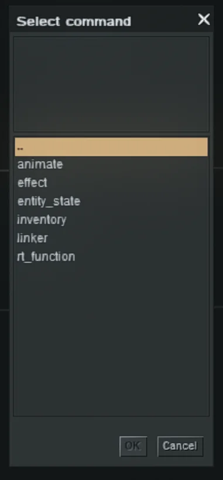
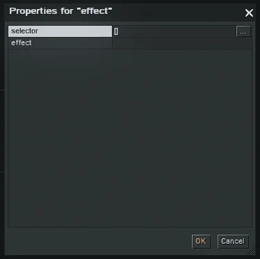
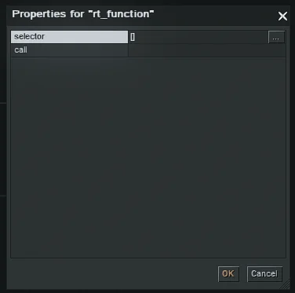

[This tutorial explains the commands found in **entity**.

To see the glossary, check it out here: [Editor Commands Glossary](/tutorials/editor-commands)

## effect

Invokes a specific scripted effect for the selected entity/actor.

**Parameters:**

- **selector**: target actor/entity (see *Selector*)
- **effect**: effect name
  (available effects depend on the selected actor/entity)

## rt_function

Assigns a specific runtime function to the selected actor/entity.

**Parameters:**

- **selector**: target actor/entity (see *Selector*)
- **call**: function to call for the selected entity