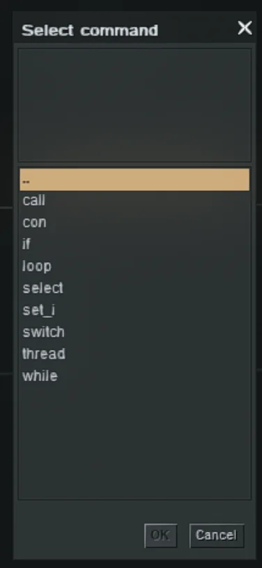
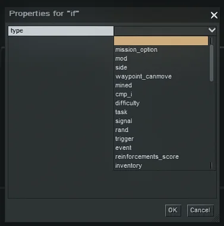
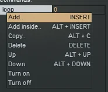
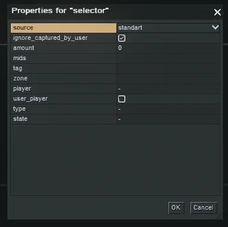
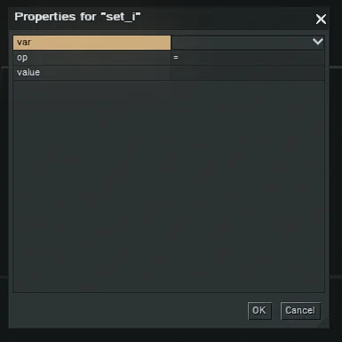
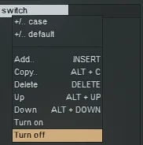
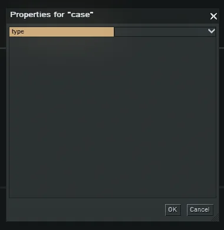
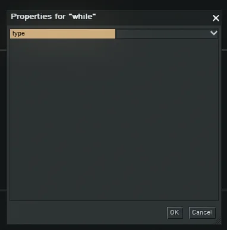

This tutorial explains the commands found in **generic**.

**if**, **loop**, **switch** and **while** behave similarly to their respective commands in computer programming. If you
are not familiar with programming, be sure to have a look at it:

- [if](https://en.wikipedia.org/wiki/Conditional_(computer_programming))
- [loop/while](https://en.wikipedia.org/wiki/Loop_(statement))
- [switch](https://en.wikipedia.org/wiki/Switch_statement)

To see the glossary, check it out here: [Editor Commands Glossary](/tutorials/editor-commands)

## if

**Parameters**:

- **type**: The type of which the if you should be applied to.
- After selecting the **type** more options will be displayed based on the selected type.

## loop

The **loop** command works differently than the other commands. Once selected from the commands, you can set the number
of iterations (in the image set to 0).
After that, right-click on the loop and choose *"Add inside..."*. Every command which is now inside the loop will be
executed the number of times you set the iterations to.

Example:

- If you set the iterations to 3,
- Then the loop will be executed three times.
- Each time the loop is executed, the commands inside the loop will be executed.

## select

Notice that it is named **select** instead of **selector**.

Game entities and actors that meet **all defined conditions** are selected.  
If a field is left empty, the corresponding condition is considered **not applied**, meaning the entity or actor
automatically fulfills that property.

**Parameters**:

- **source**: **standart**
- **ignore_captured_by_user**: TBE
- **amount**: TBE
- **mids**: Specifies the unique IDs of game entities or actors (separated by spaces).
- **tag**: Filters entities by assigned tags; Tags can be assigned to entities (for example, via the Dialogue system).
- **zone**: Selects only entities or actors located within the specified zone.
- **player**: Selects only entities belonging to the specified player.
- **user_player**: TBE
- **type**: Filters entities by type.
    - `human`
    - `auto`
    - `tank`
    - `vehicle`
- **state**: Selects actors based on their current state.
    - `dead`: Valid when `type = human`; selects dead actors.
    - `not dead`: Valid when `type = human`; selects living actors.
    - `operatable`: Valid when `type = auto` or `tank`; selects functioning vehicles with crew.
    - `not operatable`: Valid when `type = auto` or `tank`; selects damaged or crewless vehicles.
    - `moveable`: Selects entities capable of movement.
    - `not moveable`: Selects entities unable to move.
    - `inhabited`: TBE
    - `not inhabited`: TBE

## set_i

**Parameters**:

- **var**: The variable you want to set.
- **op**:
    - =: Set the variable to the value
    - +: Add the value to the variable
    - -: Subtract the value from the variable
    - *: Multiply the variable by the value
    - /: Divide the variable by the value
- **value**: The value you want to set/add/subtract/multiply/divide.

## switch

The **switch** command works by adding a **case** for each value and a **default** case.

The **case** command is executed if the value of the variable is equal to the value of the **case**.
The **default** case is executed if no **case** is executed.

For each case you can select a type, which is similar to the **if** command.

## while

The while command works similarly to the loop command. The difference is that the while command will execute the
commands inside the loop until the condition is false.
The condition is based on the type and its properties you select, similar to the **if** command.