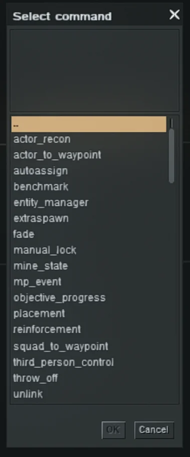
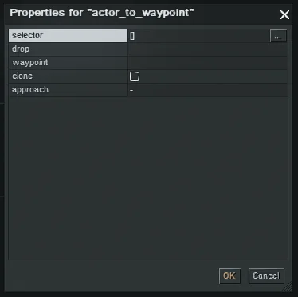

This tutorial explains the commands found in **other**.

To see the glossary, check it out here: [Editor Commands Glossary](/tutorials/editor-commands)

## actor_to_waypoint

Directs actors to a waypoint. If outgoing waypoint links exist, actors continue along the connected path.

**Parameters:**

- **selector**: the actor(s) that should start moving (see *Selector*)
- **drop**:
    - *orders*: TBE
    - *sensor*: TBE
    - *senseless*: TBE
- **waypoint (.uid / .name)**: the destination waypoint (by ID or name)
- **clone**: if enabled, the original actor does not move; a clone is spawned and moves instead
  (the clone has its own **mid**; if the original has a **tag**, the clone inherits that tag)
- **approach**:
    - *force*: forces a direct approach to the waypoint
    - *teleport*: teleports actor(s) to the waypoint
    - *teleport & rotate*: teleports and rotates actor(s) to the waypoint
    - *safe teleport*: TBE
    - *safe teleport & rotate*: TBE