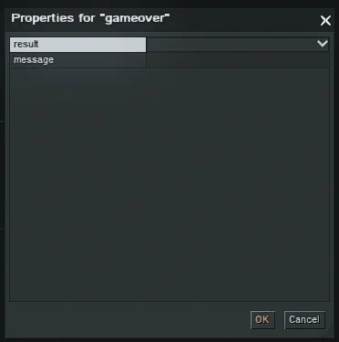
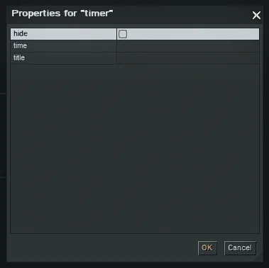

This tutorial explains the commands found in **scene**.

To see the glossary, check it out here: [Editor Commands Glossary](/tutorials/editor-commands)

## gameover

Ends the mission with a win/lose outcome.

**Parameters:**

- **result**: `win` or `loose` (spelling as in the manual)
- **message**: message shown on mission end

## music

Controls mission music.

**Parameters / Controls:**

- **start**: select and start a music file
- **stop**: stop the selected music
- **stop_all**: stops all currently played music
- **volume**:
    - *game*: TBE
    - *narrator*: TBE
    - *interface*: TBE
- **fade**: fade out
- **loop**: on/off; if enabled, the selected music restarts when it ends

## timer

Adds a mission timer.

**Parameters:**

- **hide**: hide the timer
- **time**: timer duration in seconds
- **title**: timer label/comment