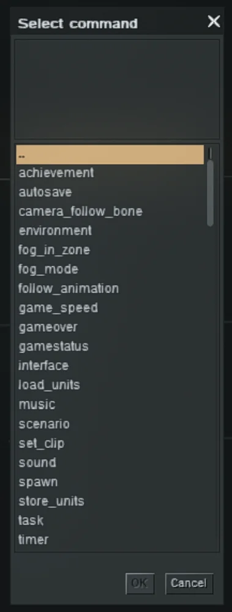
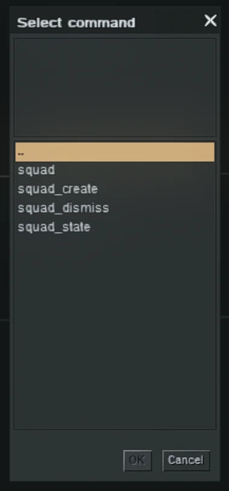

Editor Commands define **what happens** in a mission when certain conditions are met. They are mainly used in the
**Trigger Editor**, but can also be assigned to **Waypoints**.

Most commands share a common pattern:

- **selector** determines which actors/entities the command affects. (see *Selector*)
- Additional fields depend on the selected command.
- A field set to `–` means the command **does not change** that specific property.

The available commands are grouped into categories: **actor**, **entity**, **generic**, **scene**, **squad** and **other
**.

Each category will have its dedicated tutorial containing the explanation for each command. This tutorial serves as a
glossary, listing all available commands for each group.

## Actor

Check out the full tutorial here: [Actor Commands](/tutorials/editor-commands-actor)

**Commands**:

- ables
- action
- actor_component
- actor_fire
- actor_to_cover
- air_attack
- air_state
- animation
- board
- emit
- mine
- player
- talk
- wait

## Entity

Check out the full tutorial here: [Entity Commands](/tutorials/editor-commands-entity)

**Commands**:

- animate
- effect
- entity_state
- inventory
- linker
- rt_function

## Generic

Check out the full tutorial here: [Generic Commands](/tutorials/editor-commands-generic)

**Commands**:

- call
- con
- if
- loop
- select
- set_i
- switch
- thread
- while

## Scene

Check out the full tutorial here: [Scene Commands](/tutorials/editor-commands-scene)

**Commands**:

- achievement
- autosave
- camera_follow_bone
- environment
- fog_in_zone
- fog_mode
- follow_animation
- game_speed
- gameover
- gamestatus
- interface
- load_units
- music
- scenario
- set_clip
- sound
- spawn
- store_units
- task
- timer

## Squad

Check out the full tutorial here: [Squad Commands](/tutorials/editor-commands-squad)

**Commands**:

- squad
- squad_create
- squad_dismiss
- squad_state

## Other

Check out the full tutorial here: [Other Commands](/tutorials/editor-commands-other)

**Commands**:

- actor_recon
- actor_to_waypoint
- autoassign
- benchmark
- entity_manager
- extraspawn
- fade
- manual_lock
- mine_state
- mp_event
- objective_progress
- placement
- reinforcement
- squad_to_waypoint
- third_person_control
- throw_off
- unlink